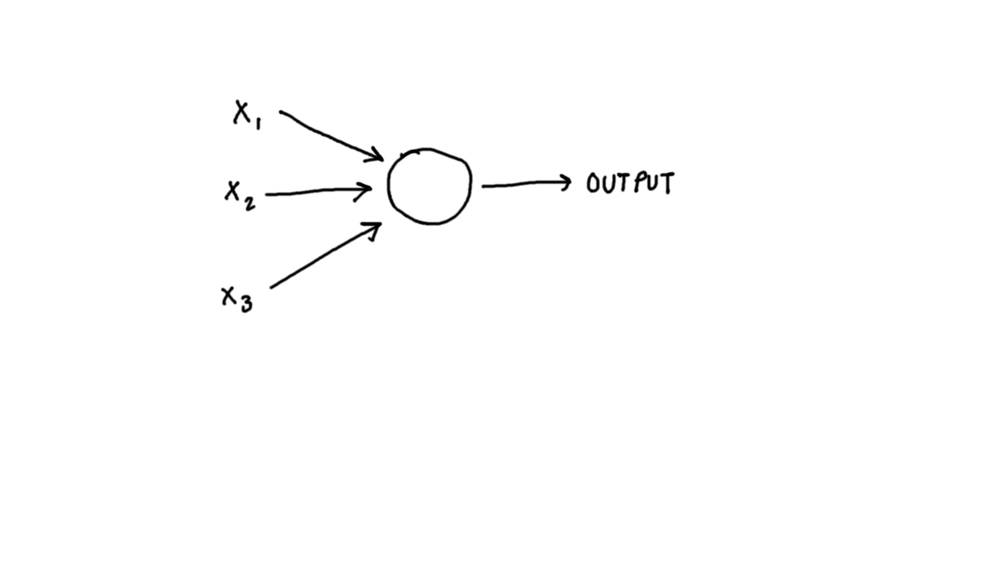

# Deep Neural Network (Rede Neural Profunda)

## Perceptron

The perceptron was invented by Frank Rosenblatt in 1957. Perceptrons are important in deep learning because they laid the foundation for more complex neural networks. Concept of the perceptron was inspired by the understanding of the human brain, specifically mimicking the way neurons function



sample code

```python
class Network(object):

    def __init__(self, sizes):
        self.num_layers = len(sizes)
        self.sizes = sizes
        self.biases = [np.random.randn(y, 1) for y in sizes[1:]]
        self.weights = [np.random.randn(y, x) 
                        for x, y in zip(sizes[:-1], sizes[1:])]
```

wip .... 🚧